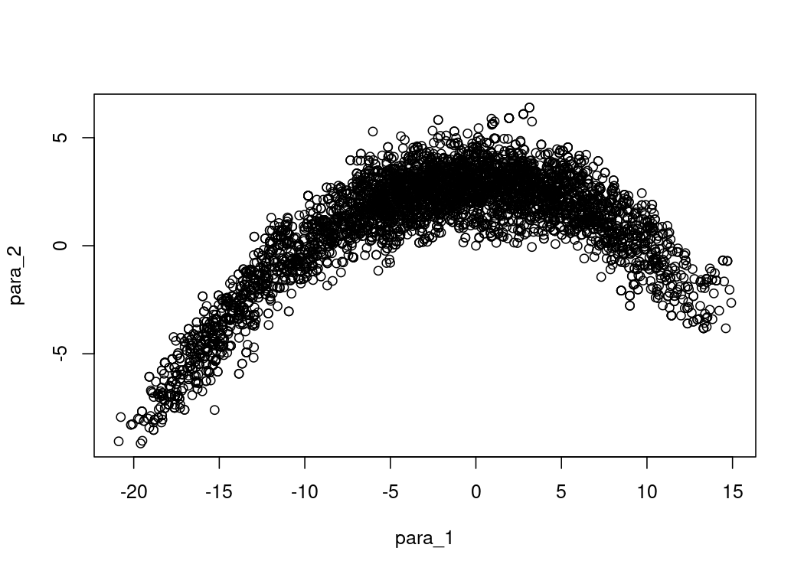

<!-- README.md is generated from README.Rmd. Please edit that file -->

# simpleMH

<!-- badges: start -->

[](https://lifecycle.r-lib.org/articles/stages.html)
[](https://github.com/Bisaloo/simpleMH/actions)
[](https://codecov.io/gh/Bisaloo/simpleMH?branch=main)
<!-- badges: end -->

This package offers a very bare-bones interface to use the
Metropolis-Hastings Monte Carlo Markov Chain algorithm. It is suitable
for teaching and testing purposes. For more advanced uses, you can check
out the [mcmcensemble](https://bisaloo.github.io/mcmcensemble/) or
[adaptMCMC](https://github.com/scheidan/adaptMCMC) packages, which are
designed with a very similar interface, but often allow better
convergence, especially for badly scaled problems or highly correlated
set of parameters.

## Installation

You can install the development version from GitHub:

``` r
# install.packages("remotes")
remotes::install_github("Bisaloo/simpleMH")
```

## Example

``` r
library(simpleMH)

## a log-pdf to sample from
p.log <- function(x) {
  B <- 0.03                              # controls 'bananacity'
  -x[1]^2/200 - 1/2*(x[2]+B*x[1]^2-100*B)^2
}

res <- simpleMH(
  p.log,
  inits = c(0, 0),
  theta.cov = diag(2),
  max.iter = 5000,
  coda = TRUE # to be able to have nice plots and diagnostics with the coda pkg
)
```

Here is the resulting sampling landscape of `p.log()`:

``` r
plot(as.data.frame(res$samples))
```



We can then use the [coda
package](https://cran.r-project.org/package=coda) to post-process the
chain (burn-in, thinning, etc.), plot the trace and density, or compute
convergence diagnostics:

``` r
plot(res$samples)
```


